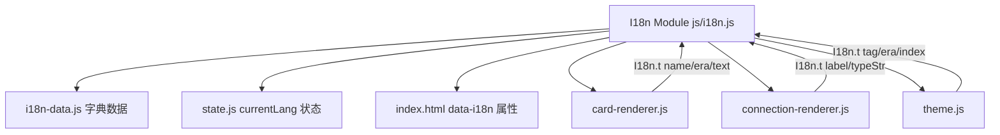

## Product Overview

在现有哲学史可视化网站（philograph）中增加完整的中英文双语切换功能，使所有界面内容（UI 标签、哲学家名字、思想观点、连线标签、过滤分类、纪元名称、年份格式、图例、关于弹窗等）均可一键切换中英文。

## Core Features

- 顶部导航栏新增中英文切换按钮（与 Western/Eastern 切换按钮同级）
- 所有 UI 硬编码文本支持中英文：标题、面板标题、选项标签、按钮文字、图例、About 弹窗内容
- 所有动态内容支持中英文：哲学家名字、思想观点文本、连线标签、纪元名称、哲学分支标签、年份格式（BC/AD vs 公元前/后）
- 语言状态持久化（localStorage），刷新后保持用户选择
- 语言切换时无需重载数据，仅重新渲染文本内容

## Tech Stack

- 纯 HTML/CSS/JavaScript 项目，无框架
- 新增 `js/i18n.js` IIFE 模块作为国际化核心

## Implementation Approach

采用 **i18n 字典 + `data-i18n` 属性** 方案：

1. **UI 静态文本**：在 HTML 元素上添加 `data-i18n="key"` 属性，切换时遍历更新 `textContent`
2. **动态内容（哲学家名/思想/连线）**：在独立 `js/i18n-data.js` 中存储中英对照字典，通过 `I18n.t('name:philosopher_id')` 等函数获取翻译，避免修改四个 JSON 数据文件
3. **JS 动态生成文本**（如 `theme.js` 的 `buildFilterPanel`、`buildIndex`、`card-renderer.js` 的 `formatYears`）：调用 `I18n.t()` 获取翻译

### Key Design Decisions

- **不修改 JSON 数据文件**：翻译字典放在 `i18n-data.js`，保持原始数据干净
- **i18n-data.js 独立文件**：~2000 行翻译数据与逻辑代码分离，维护清晰
- **语言状态存 localStorage**：`I18n.setLang()` 同时更新 State 和 localStorage
- **全量重渲染策略**：切换语言时调用 `I18n.apply()` 一次性更新所有 UI，而不是细粒度追踪每个元素

### Performance

- 字典为普通 JS 对象，O(1) 查找
- 语言切换只更新 textContent 和渲染，不触发网络请求
- i18n-data.js 约 45 位哲学家 x 5 个字段 + 100+ 条连线，内存占用 < 50KB

## Architecture Design



## Directory Structure

```
philograph/
├── index.html                       # [MODIFY] 添加 data-i18n 属性、语言切换按钮、引入 i18n.js 和 i18n-data.js
├── css/main.css                     # [MODIFY] 语言切换按钮样式
├── js/
│   ├── state.js                     # [MODIFY] 新增 currentLang 状态字段
│   ├── i18n.js                      # [NEW] 国际化核心模块：字典、t() 函数、apply()、setLang()
│   ├── i18n-data.js                 # [NEW] 翻译数据：UI 文本字典 + 哲学家名字/思想/连线/纪元/标签中英对照
│   ├── app.js                       # [MODIFY] 初始化时调用 I18n.init()，加载语言偏好
│   ├── card-renderer.js             # [MODIFY] phil.name/era/tags/idea.text 使用 I18n.t()，formatYears 国际化
│   ├── connection-renderer.js       # [MODIFY] tooltip typeStr/conn.label 使用 I18n.t()
│   └── theme.js                     # [MODIFY] buildFilterPanel/buildIndex 的文本使用 I18n.t()
├── data/
│   ├── philosophers.json            # [不修改]
│   ├── chinese-philosophers.json    # [不修改]
│   ├── connections.json             # [不修改]
│   └── chinese-connections.json     # [不修改]
```

## Implementation Notes

- `I18n.init()` 在 app.js 最顶部调用（在所有模块初始化之前），读取 localStorage 并设默认语言
- `data-i18n` 属性仅用于 HTML 中已有的静态文本；动态生成的 DOM（卡片、过滤器、索引）在各自模块中直接调用 `I18n.t()`
- 中国哲学家 name 字段已有中文名（如 "Confucius 孔子"），i18n-data.js 的 `name` 字典仅存储中文名（"孔子"），中文模式下覆盖显示
- 西方哲学家 name 字典存储中文翻译（如 "socrates" -> "苏格拉底"）
- 连线 label 同理，存储中文翻译
- About 弹窗内容较多，使用 `data-i18n` 配合 `data-i18n-html` 属性处理段落和列表
- 纪元名称如 "Pre-Qin" -> "先秦"，"Ancient" -> "古希腊罗马"，"20th Century" -> "20世纪"
- 过滤器标签如 "Confucianism" -> "儒学"，"Metaphysics" -> "形而上学"，"Ethics" -> "伦理学"
- 年份格式：英文 "470 BC" / "2020 AD"，中文 "公元前470年" / "公元2020年"

## Key Code Structures

```javascript
// js/i18n.js 核心接口
const I18n = (() => {
  let _lang = 'en';
  return {
    init(),                              // 读取 localStorage，设置默认语言
    getLang(): string,                   // 返回当前语言 'en' | 'zh'
    setLang(lang: string): void,         // 切换语言，更新 State + localStorage + 重新渲染
    t(key: string): string,              // 翻译函数，key 格式: 'ui.title' 或 'name.socrates'
    apply(): void                        // 遍历 [data-i18n] 元素更新文本 + 触发动态模块重渲染
  };
})();

// i18n-data.js 数据结构
const I18N_DATA = {
  ui: { title: { en: '...', zh: '...' }, ... },
  era: { 'Ancient': { en: 'Ancient', zh: '古希腊罗马' }, ... },
  tag: { 'Confucianism': { en: 'Confucianism', zh: '儒学' }, ... },
  name: { 'socrates': '苏格拉底', 'kongzi': '孔子', ... },
  idea: { 'sc1': { zh: '...' }, 'kz1': { zh: '...' }, ... },
  conn: { 'label_0': '继承苏格拉底美德伦理学', ... }  // 按序号索引
};
```