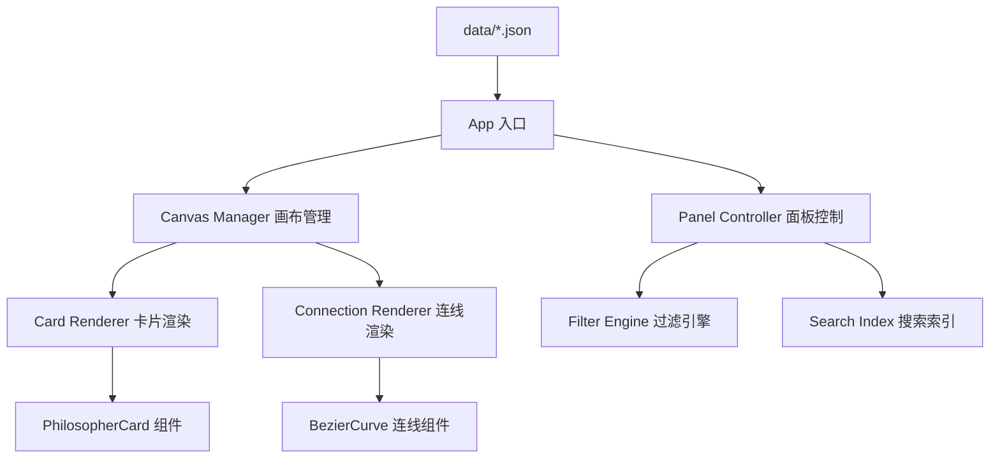

## Product Overview

复刻 "History of Philosophy - Summarized & Visualized" 网站的核心浏览体验，构建一个纯静态的哲学史可视化交互网站。用户可以在无限画布上浏览按时间轴排列的哲学家卡片，查看思想观点之间的赞同（绿色）与反对（红色）关系连线。

## Core Features

- **无限画布浏览**：拖拽平移 + 滚轮缩放，通过 CSS transform 实现
- **哲学家卡片**：按时间轴横向排列，显示姓名、生卒年份、思想观点列表
- **关系连线系统**：SVG 贝塞尔曲线绘制，绿色表示赞同、红色表示反对，点击后高亮
- **左侧控制面板**：可折叠，包含 Filters（哲学分支过滤）、Options（深色模式/标签/肖像切换）、Index（哲学家索引跳转）
- **交互功能**：点击哲学家或思想条目高亮相关连线；过滤器筛选隐藏/显示卡片
- **深色/浅色模式**：一键切换
- **数据驱动**：哲学家和关系数据存储在 JSON 文件中，约 20-30 位代表性哲学家（覆盖古希腊到现代）

## Tech Stack

- **前端框架**：纯 HTML + CSS + JavaScript（无框架依赖，静态站点）
- **数据存储**：JSON 文件（philosophers.json + connections.json）
- **连线绘制**：SVG（贝塞尔曲线）
- **画布变换**：CSS transform（translate + scale）
- **样式**：CSS Custom Properties 实现主题切换（深色/浅色模式）

## Tech Architecture

### System Architecture

采用数据驱动的分层架构：



### Module Division

- **数据层**（data/）：JSON 文件存储哲学家信息和关系数据，按朝代/时期分组
- **渲染层**（renderers/）：卡片渲染器、连线渲染器，负责 DOM/SVG 节点创建与更新
- **交互层**（interactions/）：画布拖拽缩放、点击高亮、面板交互
- **状态管理**（state/）：全局状态（当前缩放、偏移、选中项、过滤器、主题模式）

### Data Flow

1. 页面加载 → 读取 JSON 数据 → 初始化全局状态
2. 数据驱动生成哲学家卡片 DOM 节点 + SVG 连线
3. 用户交互（拖拽/缩放/点击/过滤）→ 更新状态 → 重新渲染受影响部分

### Performance Considerations

- 画布变换使用 CSS transform（GPU 加速），避免逐元素重排
- 连线 SVG 使用一次性生成，通过 CSS class 切换高亮状态（避免频繁 DOM 操作）
- 过滤切换通过 display:none + opacity transition 实现，减少回流
- 20-30 位哲学家规模下无需虚拟滚动

## Implementation Notes

- 使用原生 JavaScript，不引入任何框架或构建工具，保持纯静态可部署
- SVG 连线层与卡片层分离，SVG 层设置 pointer-events: none 以避免遮挡交互
- 贝塞尔曲线控制点根据卡片间距动态计算，确保连线美观
- 主题切换通过切换 `<html>` 元素的 data-theme 属性实现
- 响应式适配：移动端隐藏左侧面板为抽屉式，支持触摸拖拽和双指缩放

## Directory Structure

```
philograph/
├── index.html                  # [NEW] 主页面入口，包含画布容器、SVG 连线层、左侧面板结构
├── css/
│   ├── main.css                # [NEW] 全局样式、布局、主题变量（深色/浅色模式）
│   ├── canvas.css              # [NEW] 画布容器样式、变换动画
│   ├── panel.css               # [NEW] 左侧控制面板样式（过滤器、选项、索引）
│   └── card.css                # [NEW] 哲学家卡片样式、连线高亮状态
├── js/
│   ├── app.js                  # [NEW] 应用入口，初始化各模块，加载数据
│   ├── state.js                # [NEW] 全局状态管理（缩放、偏移、选中、过滤器、主题）
│   ├── canvas-manager.js       # [NEW] 画布拖拽平移与滚轮缩放逻辑
│   ├── card-renderer.js        # [NEW] 哲学家卡片 DOM 生成与更新
│   ├── connection-renderer.js  # [NEW] SVG 贝塞尔曲线连线生成与高亮控制
│   ├── panel-controller.js     # [NEW] 左侧面板交互（过滤、选项切换、索引跳转）
│   └── theme.js                # [NEW] 深色/浅色主题切换逻辑
├── data/
│   ├── philosophers.json       # [NEW] 哲学家数据（姓名、年份、时期、流派标签、思想观点列表）
│   └── connections.json        # [NEW] 关系数据（源哲学家、目标哲学家、思想条目、类型 P/N）
└── assets/
    └── portraits/              # [NEW] 哲学家肖像图片目录（可选，用占位图替代）
```

## Design Style

采用学术可视化风格，深色模式为主，突出内容可读性与视觉层次。参考原网站的暗色背景+亮色文字+彩色连线的经典数据可视化配色方案。

## Page Layout

整体为全屏画布布局，无滚动条：

- **顶部栏**：固定定位，左侧显示网站标题，右侧显示 ABOUT/MENU 按钮，高度 48px，半透明背景
- **左侧面板**：固定定位，宽 280px，可折叠，包含 Filters/Options/Index 三个折叠区域，深色半透明背景
- **主画布**：全屏容器，通过 CSS transform 实现平移缩放，内含哲学家卡片（HTML）和连线层（SVG）
- **缩放控件**：右下角固定，+/- 按钮和百分比显示

## Single Page Block Design

### 顶部导航栏

深色半透明背景（rgba(18,18,18,0.95)），左侧标题 "History of Philosophy" 使用衬线字体，右侧 MENU 按钮控制左侧面板显隐。高度 48px，底部 1px 细线分隔。

### 左侧控制面板

280px 宽度，三个手风琴折叠区域：

1. **FILTERS**：复选框列表（Metaphysics, Epistemology, Ethics 等 12 个分支 + Basics），选中时过滤显示
2. **OPTIONS**：三个开关 - Dark Mode / Tags / Portraits，使用 toggle 样式
3. **INDEX**：按字母排序的哲学家列表，点击后画布平滑滚动到对应卡片

### 哲学家卡片

每个卡片宽度约 200px，垂直排列在时间轴上。卡片头部包含哲学家姓名（大号衬线体，可点击）和生卒年份。下方为思想观点列表，每条前有彩色小圆点（对应标签颜色）。点击姓名或条目时，相关连线高亮，其余淡化。

### SVG 连线层

覆盖在卡片层下方，使用贝塞尔曲线连接不同哲学家的思想条目。绿色（#4CAF50）表示赞同，红色（#F44336）表示反对。默认 30% 透明度，高亮时 100% 不透明度并增加线宽。

### 深色/浅色主题

深色模式：深灰背景(#1a1a2e)、白色文字、半透明卡片背景；浅色模式：白色背景、深色文字、淡灰卡片背景。通过 CSS 变量一键切换。

## Agent Extensions

### Skill

- **modern-web-app**
- Purpose: 利用其 React + TypeScript + Tailwind CSS + shadcn/ui 的现代前端能力，但由于本项目要求纯静态无框架的 HTML/CSS/JS 实现，此技能将作为参考，用于确保代码质量和组件化思维
- Expected outcome: 高质量的模块化代码结构和现代化 CSS 实践